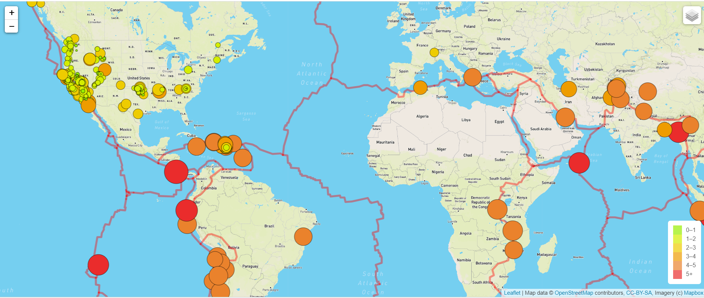
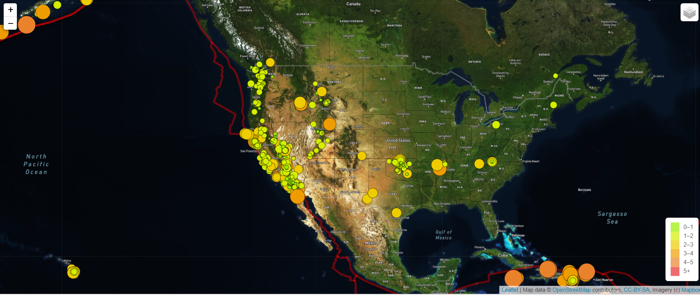
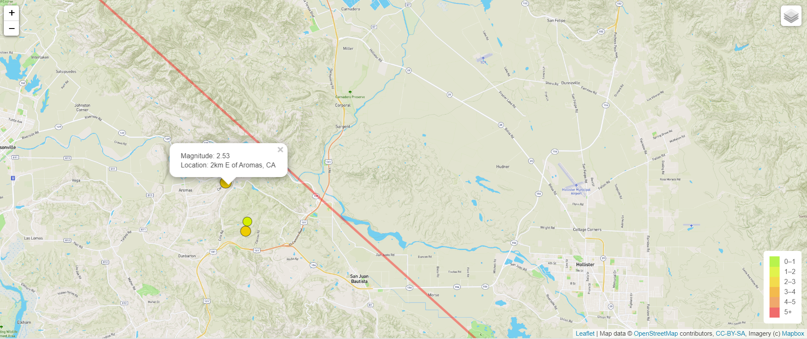

# Mapping_Earthquakes
Earthquake Mapping using GeoJSON data using JavaScript with D3 and Leaflet libraries.
Here, a map of earthquakes from the past 7days around the globe is created along with a legend indicating the intensity of the earthquake.  Also, a layer is added that shows Earth's techtonic plates so the earthquake data can be seen in relation to the plates.  There are 3 map tile layers that show the map as a street map, a satellite map, or an outdoor map.

## Street Map

## Satellite Map

## Outdoors Map

## Resources
Data Sources:

for the maps:
mapbox.com

for 7-day earthquake data:
https://earthquake.usgs.gov/earthquakes/feed/v1.0/summary/all_week.geojson

for the tectonic plates:
https://raw.githubusercontent.com/fraxen/tectonicplates/master/GeoJSON/PB2002_boundaries.json" 

Software:

Javascript
Leaflet library
D3 Library
GeoJSON files

